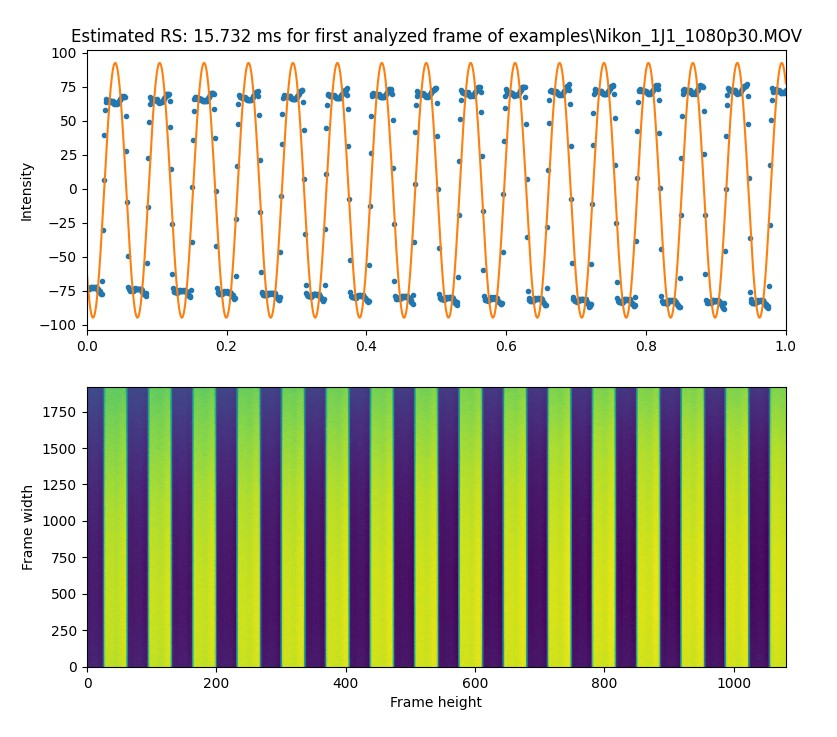

# Rolling shutter readout estimation

Tools for measuring frame readout times of rolling shutter cameras, which can be used with [Gyroflow](https://github.com/gyroflow/gyroflow) video stabilization.

```
usage: rollingshutter.py [-h] [--freq FREQ] [--start START] [--samples SAMPLES] [--plot | --no-plot] file

positional arguments:
  file                  Video file(s), supports wildcard e.g. examples\*

optional arguments:
  -h, --help            show this help message and exit
  --freq FREQ, -f FREQ  LED blinking frequency in Hz. Default=1000 Hz
  --start START, -s START
                        Video timestamp to begin analysis in seconds, default=1 s
  --samples SAMPLES, -n SAMPLES
                        Number of frames to analyze, default=50
  --plot, --no-plot     Show plot of the analysis of the first frame (default: True)
```

## Guide:

### Capture video
* Set up an LED to blink a high rate (say 1000 Hz), this can be done with an Arduino or similar. `rs_blinker` contains an example program for the Arduino Uno/Nano. For new implementations, it's recommended to double check frequency with a multimeter/oscilloscope/logic analyzer.
* Set camera shutter speed as high as possible and not a divisor of blinking frequency. So not 1/250, 1/500, or 1/1000, with anything above 1/1000 being preferred. If no manual exposure is possible on the camera, use multiple and/or bright LED's to force a higher shutter speed.
* Film the LED with the camera lens covered by something white/diffuse. Alternatively remove lens and expose sensor directly. The goal is to light the whole sensor as uniformly as possible. You should see horizontal lines forming in the video.
* Each video only needs to be 4-5 seconds long. It can also be useful to say the camera setting while recording it.
* Higher blinking frequencies give a more precise estimate, but require higher camera shutter speeds. Make sure to pass the correct blinking frequency to the script if not using the default 1000 Hz.

Example frame captured with the Nikon 1 J1 with a 1/16000 shutter speed. The high shutter speed leads to clear and crisp bands.

For shutter speeds below 1/1000, these bands will overlap. But as long as 1000 Hz isn't close to a multiple of the shutter speed, e.g. the shutter speed isn't 1/250, 1/500, or 1/1000 of a second, bands should still be detectable.

Note: Rolling shutter readout may vary with the resolution, framerate, and cropping setting.

In order to find the rolling shutter direction (up or down), you can either do this visually from panning the camera. When panning quickly to the **left**, vertical objects (`||`) will either be warped like `\\` or `//`. `\\` indicates top-to-bottom rolling shutter while `//` indicates bottom to top rolling shutter readout.

Alternatively this can be found with differently colored LED's. E.g. by flashing red briefly before blue, the order in the final video indicates the RS direction.

### Analyze video manually or automatically
The code in this repo essentially "counts" the number of horizontal lines in order to estimate the rolling shutter. At an LED rate of 1000 Hz, each line corresponds to 1 ms, so by manually counting the number of bright bands, the rolling shutter readout time is estimated to within 1 ms. The software improves upon the manual result by function fitting and averaging, giving a final rolling shutter readout value within a fraction of a millisecond.

Prerequisites: Python 3 with numpy, matplotlib, opencv and scipy. The libraries can be installed via pip:
```
pip install numpy scipy matplotlib opencv-python
```

Clone this repo:
```
git clone https://github.com/gyroflow/rollingshutter.git
cd rollingshutter
```

The repo includes some examples all recorded with a 1000 Hz LED, try processing these with:
```
> python rollingshutter.py examples\*

Analyzing examples\Nikon_1J1_1080p30.MOV
Computing average of 50 frames
Average computed
RS estimate frame 0: 15.732008836662224
RS estimate frame 1: 15.72790027898116
(...)
RS estimate frame 43: 15.729925033924998
Number of frames after removing outliers: 43 out of 50 = 86.0%
----
Final rolling shutter estimate [ms]: 15.729777 +/- 0.004046

Analyzing examples\Nikon_1J1_720p60.MOV
(...)
Final rolling shutter estimate [ms]: 15.728807 +/- 0.003413

Analyzing examples\Runcam_5_4K30.mp4
(...)
Final rolling shutter estimate [ms]: 15.849573 +/- 0.011113

Analyzed with blinking frequency of 1000.
--- RESULTS ---
filename, format, success, frame_readout_time[ms] ± error[ms]
examples\Nikon_1J1_1080p30.MOV, 1920x1080@29.97, True, 15.730 ± 0.00405
examples\Nikon_1J1_720p60.MOV, 1280x720@59.94, True, 15.729 ± 0.00341
examples\Runcam_5_4K30.mp4, 3840x2160@30.00, True, 15.850 ± 0.01111
```
By default plots are shown for each clip with a preview of the first analyzed frame:

